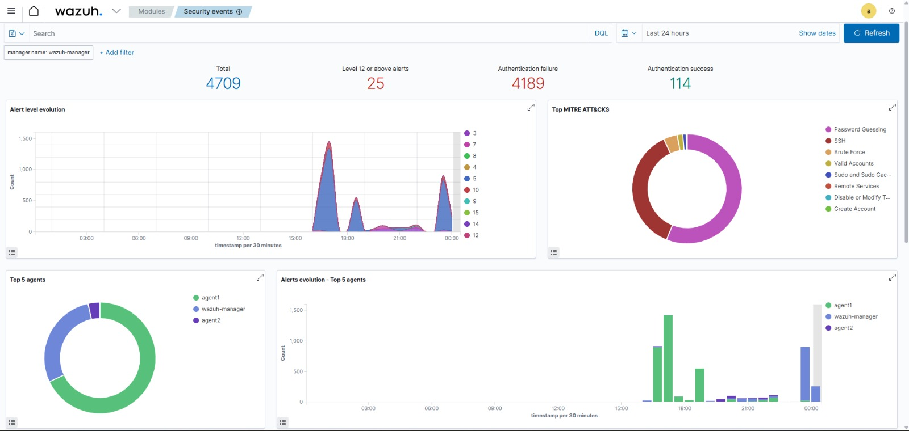
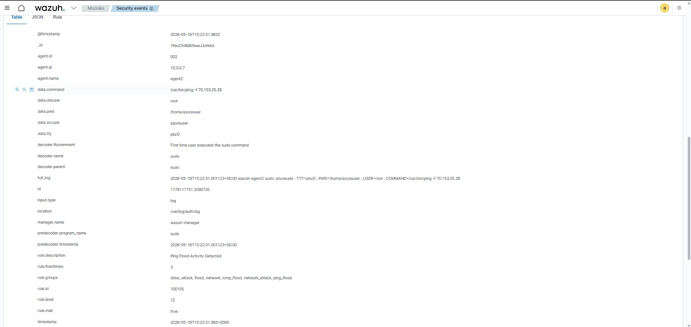
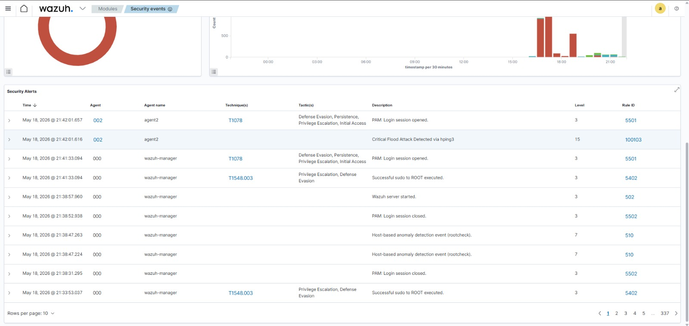
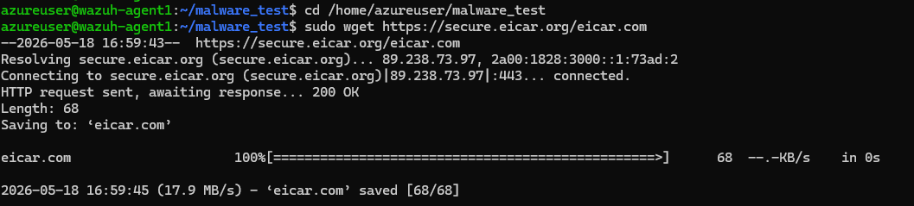

# SIEM Deployment & DDoS Simulation PoC (Wazuh) 🛡️

## 👥 Anggota Kelompok

| Nama | NRP |
| --- | --- |
| Nadia Kirana | 5027241007 |
| Oryza Qiara | 5027241084 |
| Maritza Adelia | 5027241111 |
| Adinda Cahya | 5027241117 |

---

Repositori ini berisi dokumentasi dan langkah-langkah implementasi tugas Praktikum/Proyek Keamanan Jaringan dan Manajemen Insiden. Fokus utama dari proyek ini adalah membangun infrastruktur Security Information and Event Management (SIEM) menggunakan **Wazuh**, melakukan simulasi serangan **DDoS**, serta menganalisis efektivitas deteksi insiden dan pengelolaan *logging density*.

## 📌 Deskripsi Tugas

1. **Membangun Infrastruktur SIEM (Deploy Wazuh)**: Men-deploy arsitektur Wazuh yang terdiri dari **1 Wazuh Manager** dan **2 Server Agents** menggunakan platform Azure Cloud (Student Free Tier).
2. **Membuat Skenario Serangan (DDoS Scenario)**: Mengembangkan skenario serangan Distributed Denial of Service (DDoS) komprehensif untuk menguji ketahanan dan sistem deteksi Wazuh.
3. **Membuat Proof of Concept (PoC) Deteksi Insiden**: Mendemonstrasikan kapabilitas Wazuh dalam mendeteksi anomali *traffic* (DDoS) dan men-*generate* *critical alerts*.
4. **Validasi Operasional Modul Malware**: Menguji kapabilitas sistem SIEM dalam mengenali dan memetakan berkas berbahaya secara *real-time* menggunakan berkas uji standar global.
5. **Menganalisis Log**: Menganalisis masalah *logging density* (kepadatan log) dan distribusinya, serta memberikan solusi teknis (seperti *Log Rotation* atau *Level Filtering*).

---

## 👥 Pembagian Peran (1 Manager + 2 Agent)

Karena kelompok terdiri dari 4 orang, pembagian tugas disesuaikan menjadi:

| Peran | Anggota | Tanggung Jawab Utama | Output/Deliverables |
| --- | --- | --- | --- |
| **Agent 2 (SIEM Engineer)** | *Adinda Cahya* | **(Tugas 1)** Deploy 3 VM di Azure (1 Manager, 2 Agents), install Wazuh, konfigurasi konektivitas (Active), dan *setup* Firewall/NSG Azure. | Screenshot Wazuh Dashboard menampilkan semua Agents berstatus `Active`. |
| **Agent 1 (Red Team / Attacker)** | *Nadia Kirana* | **(Tugas 2)** Menyiapkan *tools* serangan (`hping3`, `ping`), melancarkan simulasi serangan DDoS (ICMP/SYN Flood) ke VM Target, melakukan IP Spoofing. | Screenshot terminal saat menyerang & bukti server melambat (*Request Timeout*). |
| **Manager (Project Leader & SOC)** | *Maritza Adelia & Oryza Qiara* | **(Tugas 3, 4 & 5)** *Standby* di Dashboard Wazuh, menangkap *Critical Alerts*, mendemonstrasikan PoC deteksi DDoS, melakukan validasi operasional modul malware (EICAR), menyusun dokumentasi laporan, dan membuat solusi *Logging Density*. | Screenshot *Alert* Merah (Critical), Screenshot FIM Inventory (EICAR), dokumen laporan akhir, penjelasan solusi *Log Density*. |

---

## 🛠️ Konfigurasi & Implementasi

### 1. Arsitektur Infrastruktur (Azure)
- **1x VM Wazuh Manager**: Pusat kontrol dan pengumpul log/alert.
- **2x VM Wazuh Agent**: Server target yang akan dipantau dan diserang.
- Dideploy menggunakan *Azure for Students* dengan sistem operasi Ubuntu/Linux.

**Informasi Koneksi & Kredensial:**

*   **Azure Portal:**
    *   **Password:** `azureMIKS2025`
*   **Wazuh Dashboard (Manager):**
    *   **URL:** `https://70.153.25.20`
    *   **User:** `admin`
    *   **Password:** `S9uWsCUXMx54?d?.+9HZM*+hTcXrq4ex`
*   **Target (Agent 1):**
    *   **Private IP:** `10.0.0.6`
    *   **Public IP:** `70.153.25.28`
*   **Attacker (Agent 2):**
    *   **Private IP:** `10.0.0.7`
*   **Manager:**
    *   **Public IP:** `70.153.25.20`

### 2. Custom Rules Deteksi DDoS (Wazuh Manager)
Untuk mendeteksi serangan DDoS yang dilakukan, *rules* kustom berikut ditambahkan pada file konfigurasi rules Wazuh di Manager (contoh pada `/var/ossec/etc/rules/local_rules.xml`):

```xml
<!-- ========================= -->
<!-- CUSTOM DDoS DETECTION -->
<!-- ========================= -->
<group name="ddos,attack,flood,network,">

  <!-- SYN Flood Detection -->
  <rule id="100100" level="12">
    <if_sid>5402</if_sid>
    <match>SYN</match>
    <description>DDoS SYN Flood detected</description>
    <group>ddos,syn_flood,attack,</group>
  </rule>

  <!-- HTTP Flood Detection -->
  <rule id="100101" level="10">
    <match>too many connections</match>
    <description>Possible HTTP Flood Attack</description>
    <group>ddos,http_flood,attack,</group>
  </rule>

  <!-- ICMP Flood Detection -->
  <rule id="100102" level="12">
    <if_sid>5402</if_sid>
    <match>icmp</match>
    <description>ICMP Flood Attack Detected</description>
    <group>ddos,icmp_flood,attack,</group>
  </rule>

  <!-- hping3 Detection -->
  <rule id="100103" level="15">
    <if_sid>5402</if_sid>
    <match>hping3</match>
    <description>Critical Flood Attack Detected via hping3</description>
    <group>ddos,attack,hping3,flood,critical_attack,</group>
  </rule>

  <!-- Flood Keyword Detection -->
  <rule id="100104" level="14">
    <match>flood</match>
    <description>Flood Activity Detected</description>
    <group>ddos,flood,attack,</group>
  </rule>

  <!-- Ping Flood Activity -->
  <rule id="100105" level="12">
    <if_sid>5402</if_sid>
    <match>ping</match>
    <description>Ping Flood Activity Detected</description>
    <group>icmp_flood,network_attack,ping_flood,</group>
  </rule>

</group>
```

### 3. Skenario Serangan (DDoS Execution)
*Attacker* (Agent 1) melakukan simulasi serangan ke mesin *Agent* (Target) menggunakan *command* berikut:

**Skenario 1: Ping Flood (ICMP)**
Akan memicu **Rule ID 100105** (Level 12) & **Rule ID 100102** (Level 12).
```bash
sudo ping -f 70.153.25.28
```

**Skenario 2: hping3 Flood (ICMP Flood dengan IP Random/Spoof)**
Akan memicu **Rule ID 100103** (Level 15 - Critical).
```bash
sudo hping3 --icmp --flood 10.0.0.6
```

### 4. Proof of Concept (PoC) Deteksi Insiden (Tugas 3)

Berikut adalah demonstrasi bagaimana Wazuh menangani insiden serangan DDoS, mendeteksi trafik anomali, dan menghasilkan *critical alerts*. Anda dapat melampirkan screenshot pada bagian-bagian berikut:

**A. Status Konektivitas Agen (Tugas 1)**
*Deskripsi: Memastikan seluruh agen berhasil terkoneksi ke Wazuh Manager dan berstatus aktif sebelum serangan dimulai.*


**B. Pelaksanaan Serangan (Tugas 2)**
*Deskripsi: Terminal Attacker saat melancarkan serangan `ping flood` dan `hping3` ke server target.*


**C. Deteksi Anomali Trafik & Alert Kritis (Tugas 3)**
*Deskripsi: Dashboard Security Events pada Wazuh yang menunjukkan log peringatan kritis berwarna merah. Terlihat bahwa Rule ID `100105` (Ping Flood) dan `100103` (hping3 Flood) berhasil dipicu oleh serangan.*







**D. Dampak pada Server Target**
*Deskripsi: Bukti bahwa server target mengalami penurunan performa atau *Request Timeout* akibat beban dari serangan DDoS.*
> `[MASUKKAN SCREENSHOT BUKTI SERVER MELAMBAT / TIMEOUT DI SINI]`

**E. Validasi Operasional Modul Malware (Tugas Tambahan)**

*Deskripsi: Menguji kapabilitas SIEM dalam mendeteksi ancaman malware menggunakan standar global EICAR Anti-Virus Test File. Berkas ini disimulasikan sebagai berkas berbahaya yang disusupkan langsung ke direktori kritis sistem pada target (Agent 1).*

**1. Eksekusi Injeksi Berkas (Agent 1 / Target):**
```bash
# Mengunduh EICAR test file ke dalam folder testing
sudo wget https://secure.eicar.org/eicar.com

# Memindahkan berkas ke direktori sistem utama yang dipantau ketat
sudo cp eicar.com /etc/eicar.com
```

**2. Hasil Deteksi Modul Keamanan:**
Sistem Wazuh berhasil melakukan validasi operasional secara real-time. Berkas eicar.com langsung tertangkap dan dipetakan oleh modul File Integrity Monitoring (FIM) pada direktori /etc/eicar.com serta direktori pengujian, membuktikan sensor integritas SIEM berjalan 100% valid.




---

## 📊 Analisis & Solusi Logging Density (Tugas 4)

Karena serangan DDoS menghasilkan ribuan hingga jutaan paket dalam waktu singkat, hal ini dapat menyebabkan **Logging Density** (Kepadatan Log) yang sangat tinggi di sisi SIEM, membebani penyimpanan, dan menyulitkan analisis. 

**Solusi yang kami implementasikan / usulkan:**
1. **Level Filtering (Alert Level Threshold)**: Wazuh secara default hanya akan menyimpan dan mengirim notifikasi untuk *alert* dengan level di atas threshold tertentu (misal: hanya mencatat peringatan Level 7 ke atas).
2. **Anti-Flooding (Active Response)**: Mengaktifkan *Active Response* pada Wazuh (contoh: *firewall-drop*) untuk memblokir IP penyerang secara otomatis selama beberapa menit jika *Rule* DDoS (misal Level 12 atau 15) terpicu, sehingga log tidak terus-menerus membanjiri sistem.
3. **Log Rotation & Retention Policy**: Mengkonfigurasi *logrotate* pada server Linux dan *retention policy* pada Wazuh Indexer agar log lama dikompresi atau dihapus secara otomatis (misal: simpan selama 30 hari).

